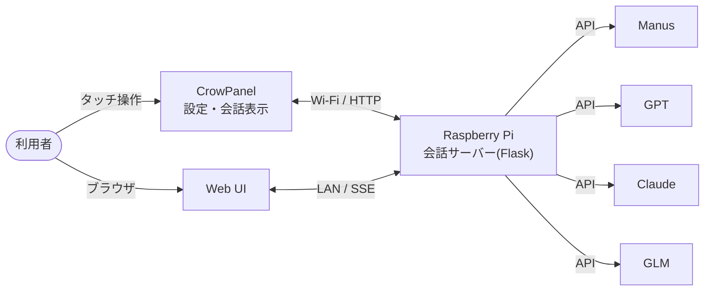

# Manus × GPT × Claude × GLM ── AI同士が会話する仕組み(Raspberry Pi + CrowPanel)

**Manus / GPT(OpenAI) / Claude(Anthropic) / GLM(z.AI)** の中から2〜4体を選び、指定したテーマについて
ターン制で会話させます。会話の様子は、**ブラウザ**でも、**CrowPanel Advanced 7inch(ESP32-P4)のタッチ画面**でも、
LINE風の吹き出しでリアルタイムに見られます。会話が終わると、AIごとの視点や「AI間で見解が分かれた点」を
自動で要約します。

[【ESP32×ラズパイ】4つのAIが雑談する装置 | 初版完成 (GPT×Claude×Manus×GLM)](https://youtu.be/I4d_IhmYvpA)
> [!NOTE]
> 個人による試作(プロトタイプ)です。Manus・OpenAI・Anthropic・z.AI・ELECROWの各社とは無関係の
> 非公式プロジェクトです。コードやドキュメントの一部はAI(Claude / Manus)による生成物を含み、
> 内容の正確性は保証しません。ご利用は自己責任でお願いします。

## しくみ

- **Raspberry Pi** が全体を制御します(会話の進行・記録・要約)。**APIキーはPiの `.env` にだけ**置き、
  ブラウザにもCrowPanelにも渡しません。
- **CrowPanel** は、設定(参加AI・司会・トーン・ターン数・テーマ)と表示・操作を担当します。
- START後は、司会AIが話題を切り出し、司会以外→…→司会の順に各AIが発言します。各AIには、毎回
  「役割・トーンの指示」と「これまでの会話の全文」を渡します。指定ターン数で終了し、要約AIが要約を作ります。

## 構成

| ディレクトリ | 内容 |
| :--- | :--- |
| [`1.Raspberry Pi版/`](1.Raspberry%20Pi版/) | 会話サーバー(Flask)。ブラウザ用のWeb UIと、CrowPanel向けのAPIを備える。**まずここから** |
| [`2.ESP32版/`](2.ESP32版/) | CrowPanel Advanced 7inch 用ファームウェア(ESP-IDF + LVGL) |

CrowPanelが無くても、`1.Raspberry Pi版` だけでブラウザから使えます。

## クイックスタート

1. **Raspberry Pi**(または、PythonがあるPC)で、[`1.Raspberry Pi版/README.md`](1.Raspberry%20Pi版/README.md)
   の手順でサーバーを起動する。`.env` に、使いたいAIのAPIキーを書く。
2. 同じLANのブラウザで `http://<PiのIPアドレス>:5000` を開き、テーマと参加AIを選んで **START**。
3. (任意)CrowPanelに表示したい場合は、[`2.ESP32版/README.md`](2.ESP32版/README.md) の手順で
   ファームウェアをビルド・書き込みする。

## 動作確認環境

- Raspberry Pi 5 / Raspberry Pi OS 64bit(Bookworm)/ Python 3.11
- CrowPanel Advanced 7inch **V1.1** / ESP-IDF v5.5.5 / LVGL 8.4.0

## 注意事項

- **認証もHTTPSもありません。** 信頼できるローカルLAN内だけで使い、インターネットに公開しないでください。
- 会話ログ(テーマ・全発言・要約)は、Piの `logs/` に自動保存され、自動では消えません
  (画面の「保存済みログを全削除」ボタンで削除できます)。
- 各社のAPIは、利用量に応じて課金されます。ご自身のキー・利用枠の範囲でお使いください。
- **APIキー・Wi-Fiのパスワードは、絶対にコミットしないでください**(`.env` と `sdkconfig` は `.gitignore` 済みです)。

## 既知の課題

- CrowPanelの日本語は、常用漢字2,136字のビットマップフォントです。**常用漢字外の漢字(例: 惹)と絵文字は □ になります。**
  収録字数を増やすと描画が不安定になる症状が出たため、対策を検討中です([`2.ESP32版/README.md`](2.ESP32版/README.md#既知の課題))。
- CrowPanelの自由入力のテーマは英語のみです(日本語入力に非対応)。

## 使っているもの・出典

- [ESP-IDF](https://github.com/espressif/esp-idf)(Apache-2.0)、[LVGL](https://lvgl.io/)(MIT)、
  [esp_lvgl_port](https://components.espressif.com/components/espressif/esp_lvgl_port) 等のEspressifコンポーネント
  (ビルド時にコンポーネントマネージャーが取得します)
- [Noto Sans JP](https://fonts.google.com/noto/specimen/Noto+Sans+JP)(SIL Open Font License 1.1)から
  生成したビットマップフォント([`2.ESP32版/main/fonts/`](2.ESP32版/main/fonts/README.md))
- ELECROWの[公式サンプル](https://github.com/Elecrow-RD/CrowPanel-Advanced-7inch-ESP32-P4-HMI-AI-Display-1024x600-IPS-Touch-Screen)の
  ボード依存コード(`bsp_display` / `bsp_i2c` / `bsp_wifi`)。ライセンス表記が無いため**同梱せず**、
  取得用スクリプトを用意しています
- 各社名・製品名は、それぞれの権利者の商標または登録商標です。

## ライセンス

このリポジトリのオリジナルのコード・ドキュメントは、[MIT License](LICENSE)(© 2026 punitaka)です。

ただし、次のものは**MITの対象外**で、それぞれの元のライセンスに従います。

- 日本語フォント `2.ESP32版/main/fonts/notosans_jp_20.c`: Noto Sans JP 由来(SIL Open Font License 1.1)
- ビルド時に取得する ESP-IDF・LVGL・Espressifのコンポーネント(各パッケージのライセンス)
- `tools/fetch_elecrow_bsp.py` で各自が取得する ELECROW の `bsp_*`(ELECROW社に帰属)

## 関連リンク

- [Manus API v2](https://open.manus.ai/docs/v2/introduction) / [OpenAI API](https://platform.openai.com/docs) /
  [Anthropic API](https://docs.anthropic.com/) / [z.AI API](https://docs.z.ai/api-reference/introduction)
- [CrowPanel Advanced 7inch ESP32-P4 公式リポジトリ](https://github.com/Elecrow-RD/CrowPanel-Advanced-7inch-ESP32-P4-HMI-AI-Display-1024x600-IPS-Touch-Screen)
- YouTube: [@regional-engineer](https://www.youtube.com/@regional-engineer)
